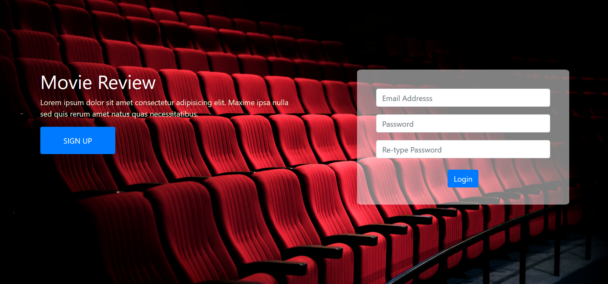
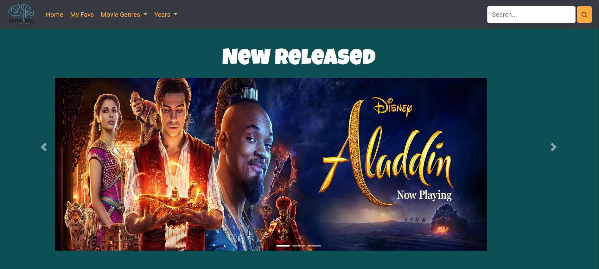
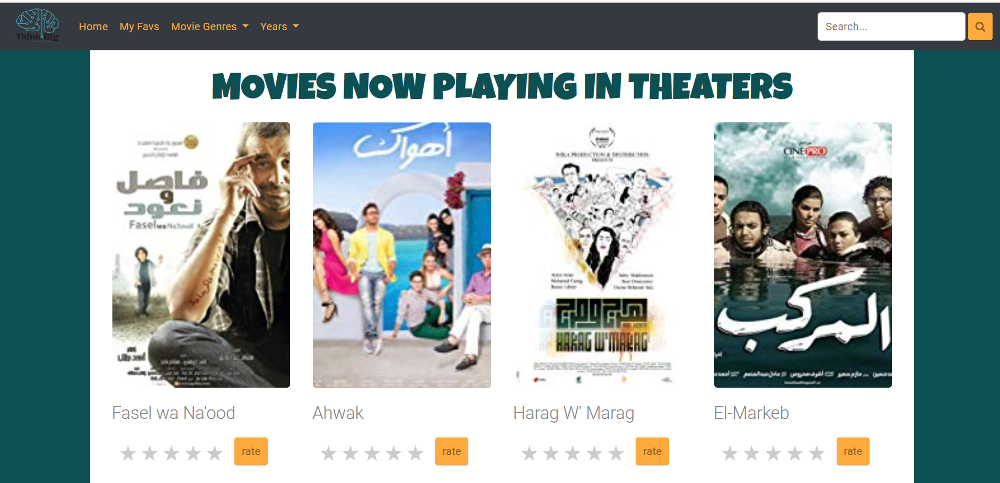

# Movie Recommendations Fe Assignment
This repository contains an assignment for our summer interns'19 candidates.
and Here is some modifications.

## Modification

## Features supported by the front end 
As can be seen from the image below the features included are: 
 - Header Section Controls
   - Visitor will enter his email address. In return our WebServer will send an authentication token to the email address provided
   - Visitor will verify their email address by entering the received authentication token 
   -**This replaced by new page for signing up and loging** 
   - Visitor can subscribe/unsubscribe to our service (same button, which will change based on the user status, i.e. subscribed or not)
 - Movies Section Controls 
   - Visitor can search for a movie (right search panel)
   - Visitor can filter the movies by year or type (left drop down lists)
   -**This changed by fixed navbar which have filters and search bar** 
     
   - Visitor can get the next batch of movies. We are not including that button in the page, you decide where is best place to have it
   -**A pagination bar is added at end of movies section**
   - For each movie
     - Visitor can provide a rating 
     - Visitor can ask us to provide him "his learned rating" (the test button, ehm, u can call it something else )
     -**The name has changed**

 
  

